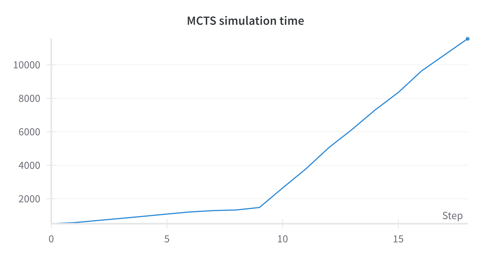
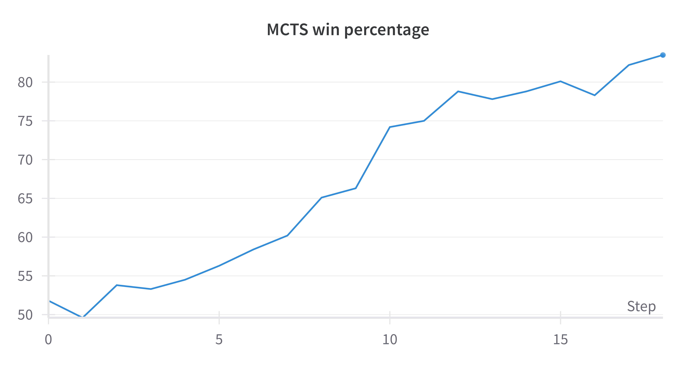

# AlphaLudo - A Reinforcement Learning Approach to Ludo

$${\color{red}This \space project \space is \space under \space active \space development. \space Future \space updates \space and \space improvements \space are \space planned.}$$

## Table of Contents
1. [Introduction](#introduction)
2. [Motivation and Research Objectives](#motivation-and-research-objectives)
3. [Methodology](#methodology)
4. [Key Findings](#key-findings)
5. [Future Work](#future-work)
6. [Conclusion](#conclusion)
7. [Acknowledgment](#acknowledgment)
8. [References](#references)

---

## Introduction
AlphaLudo is a reinforcement learning-based implementation of the classic Indian board game Ludo. This project applies cutting-edge AI methodologies to create competitive game-playing agents. The development is inspired by Google’s AlphaZero and explores both traditional and deep learning-based approaches.

---

## Motivation and Research Objectives
The goal of this project is to explore reinforcement learning techniques applied to complex board games. Ludo presents an interesting challenge due to its stochastic nature, requiring agents to balance strategic planning and adaptability. The project focuses on:
- Developing intelligent agents using Monte Carlo Tree Search (MCTS) and Policy Value Networks.
- Comparing and analyzing the performance of these models.
- Exploring optimization methods for enhancing agent performance.

---

## Methodology
### Implemented Models
1. **Vanilla Monte Carlo Tree Search (MCTS):**
   - Uses a search-based approach balancing exploration and exploitation.
   - Efficiently navigates game states through tree-based exploration.

2. **Policy Value Network:**
   - Leverages neural networks for game state evaluation and move prediction.
   - Incorporates deep learning models inspired by AlphaZero.

---

## Key Findings
- Vanilla MCTS demonstrated superior performance compared to the Policy Value Network, excelling in both strategic planning and decision-making.
- The Policy Value Network shows promising potential, though it currently underperforms compared to MCTS.

We build the vanilla MCTS for a fixed number of depths for 1000 games and found that with the winning percentage is increasing as we build the tree more deeper.

| MCTS Simulation Time vs MCTS Tree Depth | MCTS Win Percentage over Random player vs MCTS Tree Depth |
|---|---|
|  |  |

---

## Future Work
- **Online Evolutionary Algorithms:** Plan to integrate evolutionary algorithms for dynamic optimization of MCTS.
- **Enhanced Learning Models:** Further refine the Policy Value Network with deeper architectures and better training data.

---

## Conclusion
AlphaLudo successfully implements reinforcement learning-based agents capable of playing the board game Ludo. The project demonstrates the effectiveness of MCTS and highlights future directions for improving deep learning-based strategies.

---

## References
- **Google’s AlphaZero Project**: https://deepmind.google/discover/blog/alphazero-shedding-new-light-on-chess-shogi-and-go/
- **Research Papers**:
  
   1.Świechowski, Maciej, Konrad Godlewski, Bartosz Sawicki, and Jacek Mańdziuk. "Monte Carlo tree search: A review of recent modifications and applications." Artificial Intelligence Review 56, no. 3 (2023): 2497-2562.

Stay tuned for more updates as we continue enhancing AlphaLudo!
